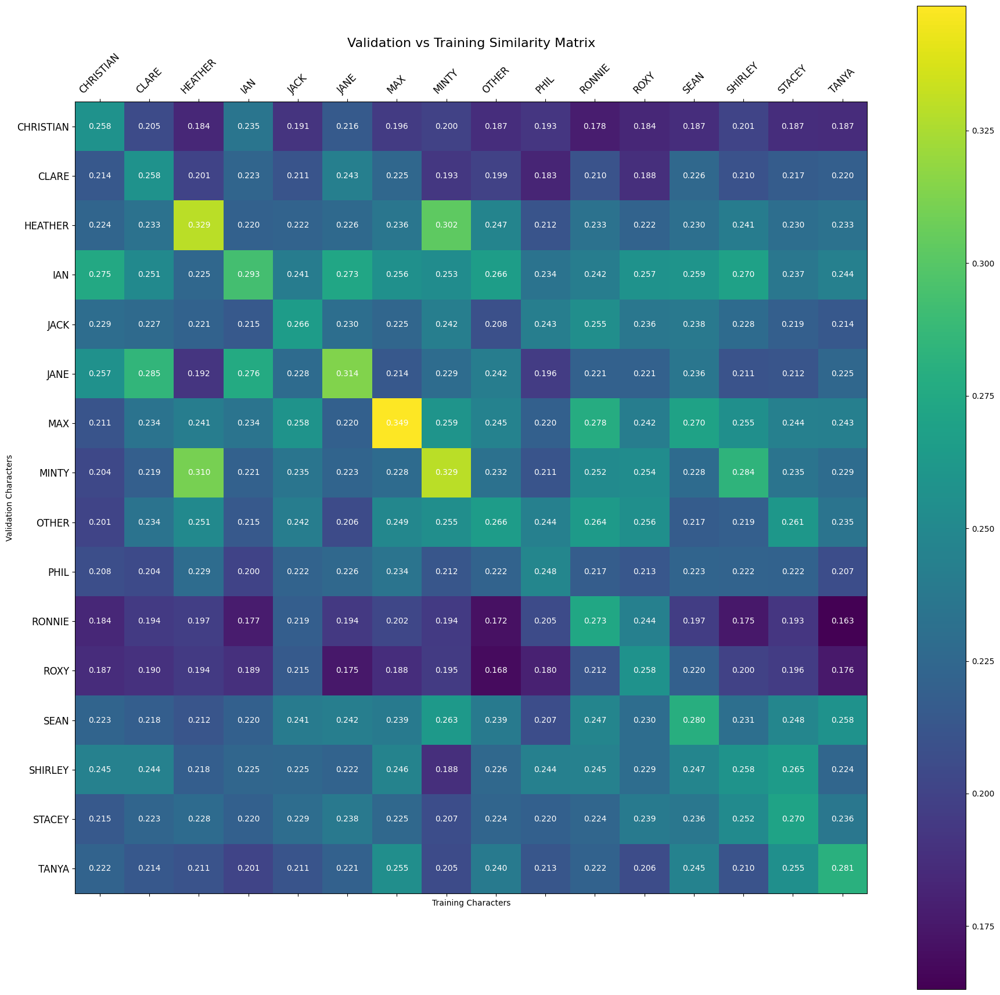

# Character Dialogue Retrieval

This project identifies a speaker from a block of dialogue. It uses dialogue from 16 EastEnders characters to build one reference representation for each character, then compares held-out dialogue with all 16 references and ranks the possible speakers by similarity.

The system does not make a direct class prediction in the usual sense. It asks a retrieval question instead. If a new block of dialogue belongs to Jane, how close is that dialogue to Jane's training dialogue compared with Ian, Max, Shirley, Ronnie, and the other characters?

A result is strongest when the correct character is ranked first. The final system reached a **mean rank of 1.0625 with 93.75% top-1 accuracy on validation data**. On the separate test set it reached a **mean rank of 1.375 with 87.5% top-1 accuracy**.

## What is being compared

The training data is grouped by character. Up to the first 300 non-empty lines spoken by each character are joined into one training document. Validation and test data use up to the first 50 lines per character.

That gives the system one training document for each of the 16 speakers and one held-out document for each speaker.

For example, the training side can be thought of like this:

```text
JANE     -> first 300 training lines spoken by Jane
IAN      -> first 300 training lines spoken by Ian
MAX      -> first 300 training lines spoken by Max
...
```

A held-out Jane document is converted into the same vector representation and compared with all 16 training vectors. If the similarities look like this:

```text
Jane       0.31
Ian        0.24
Christian  0.21
Max        0.18
...
```

Jane has rank 1 and the retrieval is counted as correct.

If Jane were second, her rank would be 2. This is why I use both **top-1 accuracy** and **mean rank**. Accuracy only tells me whether the correct character came first. Mean rank also distinguishes a near miss at rank 2 from a much weaker result at rank 6.

## Turning dialogue into vectors

The final representation is based mainly on TF-IDF word features.

TF-IDF gives a numerical weight to a word or phrase based on how strongly it belongs to one document compared with the rest of the collection. A phrase that appears everywhere is less useful for distinguishing speakers. A phrase that appears repeatedly for a smaller number of characters can carry more information.

The final model uses both individual words and two-word phrases. These are usually called **unigrams** and **bigrams**.

For a short phrase such as:

```text
leave me alone
```

a unigram representation can include:

```text
leave
me
alone
```

and the bigram representation can also include:

```text
leave me
me alone
```

The bigrams matter because two characters may use many of the same individual words while combining them differently.

## Preprocessing

Before the dialogue is vectorized, the text can go through the following steps:

1. Unicode normalization
2. Lowercasing
3. Replacing digits with a shared number token
4. Tokenization
5. Punctuation removal
6. English stop-word removal
7. Lemmatization
8. Removal of very short tokens

The preprocessing options are kept configurable because the experiments showed that a standard text-cleaning step is not automatically useful just because it is common in NLP.

For example, the written report records an earlier preprocessing-only checkpoint at **mean rank 1.5 and 75% accuracy**. Later in the notebook, a systematic grid over the preprocessing switches found a stronger unigram TF-IDF setting at **mean rank 1.25 and 81.25% accuracy**. That later grid used stop-word removal and punctuation removal, did not use lemmatization, and kept tokens of length one or more.

I keep those results separate because they came from different experiment stages rather than treating one number as a correction of the other.

## The change that helped most

The largest improvement came from adding word bigrams and filtering out one-off features.

The best validation setting used:

```text
word n-grams:       unigrams + bigrams
minimum frequency:  feature must appear in at least 2 character documents
maximum frequency:  no extra upper-frequency filtering
sublinear TF:        enabled
character n-grams:   disabled
SVD:                 disabled
style features:      enabled with weight 0.1
row normalization:   L2
```

With this representation, validation performance reached:

| Metric | Result |
| --- | ---: |
| Mean rank | **1.0625** |
| Top-1 accuracy | **93.75%** |
| Mean self-similarity | 0.2831 |

Fifteen of the sixteen validation characters were ranked first. Shirley was the only one ranked second.

The important part was not simply adding more bigrams. Setting the minimum document frequency to 2 removed phrases that appeared in only one character document. Those one-off phrases created a large sparse vocabulary without reliably helping the held-out dialogue. Keeping repeated bigrams gave the model more local phrasing information while removing much of that noise.

## Experiments that did not improve the ranking

Several more complicated representations sounded promising but did not beat the filtered word bigrams.

### SVD

I tested truncated SVD with 100, 200, and 300 components. The validation mean rank stayed at **1.3125** for each of those settings, the same as the unigram system used in that subgrid.

SVD compresses a high-dimensional text matrix into a smaller set of latent dimensions. In this dataset, that compression did not improve character identification. The task appears to benefit more from retaining specific lexical patterns than from smoothing them into broader dimensions.

### Character n-grams

I also tested character sequences of lengths 3 to 5 and 4 to 6. None of the tested character n-gram combinations beat the word-only bigram system. Some made the ranking considerably worse, reaching mean ranks around **1.56 to 1.63**.

Character n-grams can capture spelling and stylistic patterns, but here they added many extra features without providing a better character signal than repeated word phrases.

### Lowering `max_df`

The best system leaves `max_df` at 1.0. Lowering it to 0.95 changed validation performance from **1.0625 mean rank and 93.75% accuracy** to **1.125 mean rank and 87.5% accuracy**.

That result suggests that some very common words still carry useful information about how these characters speak. Removing a feature simply because it is common across documents can throw away speaker-specific patterns.

### Style features

Five small document-level style measurements were tested:

- average token length
- type-token ratio, which measures vocabulary variety
- ratio of number-like tokens
- ratio of tokens with three or fewer characters
- ratio of tokens with eight or more characters

Adding these features did not change the best validation rank or accuracy. Style weights of 0.1, 0.2, and 0.3 all remained at **mean rank 1.0625 and 93.75% accuracy**.

I kept the lightest weight, 0.1, because the features were stable and did not damage the lexical representation. The experiments do not show that these style measurements caused the performance gain. The filtered word bigrams were the decisive change.

## Similarity between characters

The heatmap below compares every validation character document with every training character document using the final representation.



The diagonal contains each character's similarity with their own training dialogue. A strong diagonal means the held-out dialogue usually resembles the correct character more than the others.

The similarity analysis also gives more information than the top-1 score. The report noted that some characters have relatively strong wrong matches because their dialogue uses similar language. Heather and Minty were one example, with both using short conversational phrasing and informal vocabulary. Christian and Ian also showed linguistic overlap in the similarity matrix.

These relationships matter because a retrieval error does not always mean the representation is unstable. Sometimes two characters genuinely use overlapping vocabulary and phrasing in the available scripts.

## Test-set result

After choosing the representation on validation data, the same configuration was fitted on the training documents and evaluated on a separate test set.

| Metric | Test result |
| --- | ---: |
| Mean rank | **1.375** |
| Top-1 accuracy | **87.5%** |
| Mean self-similarity | 0.2993 |

Fourteen of the sixteen characters were ranked first.

The two exceptions were:

| Character | Rank |
| --- | ---: |
| Ronnie | 2 |
| Jack | 6 |

Jack's result is useful to look at because accuracy alone treats rank 6 the same as rank 2. Mean rank makes that difference visible.

## How the code is organised

The original experimentation has been separated into small Python modules so the data preparation, text representation, retrieval, and evaluation can be read independently.

```text
character-dialogue-retrieval/
├── src/character_retrieval/
│   ├── data.py              # load dialogue and build one document per speaker
│   ├── preprocessing.py     # configurable text preprocessing
│   ├── features.py          # TF-IDF, n-grams, style features, and optional SVD
│   ├── retrieval.py         # fit character references and rank new dialogue
│   └── evaluation.py        # mean rank, accuracy, and similarity calculations
├── scripts/
│   └── evaluate.py          # run the final system on local CSV files
├── examples/
│   └── synthetic_demo.py    # small example that does not use TV dialogue
├── assets/
│   └── validation_similarity_heatmap.png
├── data/
│   └── README.md            # expected dataset format
├── tests/
│   ├── test_data.py
│   ├── test_preprocessing.py
│   ├── test_features.py
│   └── test_retrieval.py
├── pyproject.toml
└── README.md
```

## Running the code

Python 3.10 or newer is recommended.

Install the package from the repository root:

```bash
pip install -e .
```

The full preprocessing pipeline uses NLTK stop words, Punkt tokenization, and WordNet lemmatization. Download those resources once with:

```bash
python -m nltk.downloader punkt punkt_tab stopwords wordnet omw-1.4
```

The synthetic example does not need the EastEnders dataset:

```bash
python examples/synthetic_demo.py
```

Run the tests with:

```bash
python -m unittest discover -s tests -v
```

The cleaned project currently has **8 tests** covering document construction, preprocessing options, style features, unigram and bigram vectorization, ranking, mean-rank evaluation, and synthetic character retrieval.

If you have dialogue files in the same format as the original data, evaluate the final configuration with:

```bash
python scripts/evaluate.py path/to/training.csv path/to/test.csv
```

The script uses up to 300 training lines and 50 held-out lines per character by default.

## Dataset

The raw EastEnders dialogue files are not included in this repository. They contain copyrighted script dialogue, and the materials I have do not establish that the text can be redistributed publicly.

The code expects tab-separated files with at least these columns:

```text
Character_name
Line
```

The original files also contained episode, scene, scene information, and gender columns, but those fields are not needed by the retrieval model.

The scores reported above come from the saved outputs in the completed experiment. The cleaned code preserves the same final feature configuration, but the public repository does not include the raw dialogue needed to rerun those exact numbers.

## What I took from this project

The strongest result came from a fairly simple change. I expected some of the more complex representations to help, especially SVD or character n-grams. They did not. Repeated two-word phrases were much more useful for separating the speakers.

That made the role of feature filtering clearer to me. Bigrams alone created many features that appeared once and did not transfer to held-out dialogue. Requiring a phrase to appear in at least two character documents removed much of that noise while keeping recurring phrasing patterns.

Mean rank was also more informative than accuracy for this task. A correct character at rank 2 is a near miss. A correct character at rank 6 means several other speakers looked more similar. Looking at those rankings made it easier to see where the representation was uncertain rather than reducing every mistake to the same zero-or-one outcome.

The heatmap added another useful view. Some wrong similarities made sense once I looked at the characters involved. The system was not only picking up topic words. It was also reflecting repeated ways of speaking that could be shared between characters. That helped me distinguish a modelling problem from genuine overlap in the dialogue.